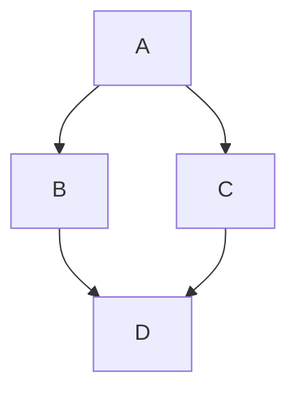

# Markdown Feature Test File

## Headings
# H1
## H2
### H3
#### H4
##### H5
###### H6

---

## Text Formatting
- **Bold text**
- *Italic text*
- ***Bold and italic***
- ~~Strikethrough~~
- ==Highlight== (for renderers that support it)
- `Inline code`

---

## Code Blocks
```bash
#!/bin/bash
echo "Hello World"
```

```python
def hello():
    print("Hello from Python!")
```

---

## Blockquotes
> This is a blockquote.
>> Nested blockquote.

---

## Lists
### Unordered
- Item 1
  - Sub-item 1
    - Sub-sub-item 1

### Ordered
1. First
2. Second
   1. Sub-first
   2. Sub-second

---

## Task Lists
- [x] Completed task
- [ ] Incomplete task
- [ ] Another task

---

## Tables
| Column 1 | Column 2 | Column 3 |
|---------|----------|----------|
| Row 1   | Data     | More     |
| Row 2   | Data     | More     |

---

## Links
- [OpenAI](https://openai.com)
- [Relative Link](./relative.md)

---

## Images


---

## Horizontal Rule
---

## Escaping Characters
\*Not italic\*

---

## Math (if supported)
Inline math: $a^2 + b^2 = c^2$

Block math:
$$
\int_0^1 x^2 \, dx = 1/3
$$

---

## Footnotes
Here is a sentence with a footnote.[^1]

[^1]: This is the footnote.

---

## Definition Lists (GitHub does not support, but some renderers do)
Term 1
: Definition 1

Term 2
: Definition 2

---

## HTML Support
<div style='color: red; font-weight: bold;'>This is HTML inside Markdown.</div>

---

## Emoji
:smile: :rocket: :+1:

---

## Fenced Divs (for renderers that support it)
::: info
Info-style block.
:::

---

## Mermaid Diagrams


---

## YAML Frontmatter
---
title: Markdown Test File
author: Copilot
date: 2026-03-17
---

---

## End of File
